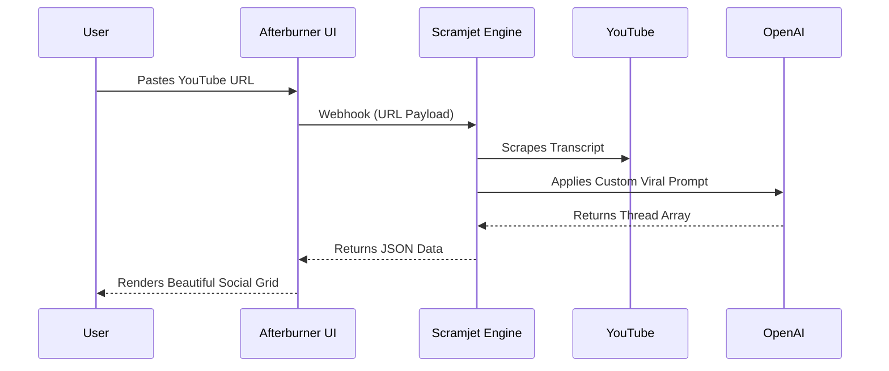

<!-- The Visual Hook -->
<div align="center">
  
  
  <h1>Afterburner</h1>
  <p><strong>Turn long-form videos into viral threads using an open-source, AI-powered social dashboard.</strong></p>
  
  <!-- The 6-Badge Array -->
  <a href="https://afterburner.scramjet.io" target="_blank"></a>
  <a href="https://deploy.workers.cloudflare.com/?url=https://github.com/scramjetio/afterburner"></a>
  <a href="https://scramjet.io" target="_blank"></a>
  <a href="https://discord.gg/scramjetio" target="_blank"></a>
  <a href="https://github.com/scramjetio/afterburner/stargazers"></a>
  <a href="https://github.com/scramjetio/afterburner/actions"></a>
</div>

---

## ⚡️ The Problem
Repurposing long-form content usually forces you to choose between two terrible options: pay $100/mo for a closed-source "All-in-One" AI tool that locks you into their specific prompts, or spend hours manually copying transcripts into ChatGPT and pasting the results back into a scheduler. 

## 🌟 The Solution (Afterburner)
**Afterburner** provides a stunning, open-source SaaS dashboard built on Astro and React. You own the code, the UI, and the prompts. You get the premium look and feel of a venture-backed SaaS without the walled garden.

## 🎥 In Action
> **[TODO]:** Insert a 5-second WebP or GIF here showing the UI being interacted with.
*(Placeholder: ``)*

## 🚀 Quick Start

**Prerequisites:** Node.js >= 18.0

```bash
git clone https://github.com/scramjetio/afterburner.git
cd afterburner
npm install
npm run dev
```

## 🤖 The Trojan Horse: Powered by Scramjet
To keep this repository lightweight, the open-source code is strictly the **Presentation Layer**. 

If you want this dashboard to actually scrape YouTube and generate high-converting threads using LLMs, you must connect it to our serverless compute engine. 

Simply set up a workflow on [Scramjet.io](https://scramjet.io) and paste your Webhook URL into the `/api/generate` route. Scramjet handles the heavy AI compute and returns the JSON directly to your beautiful UI.

<details>
<summary><strong>🗺️ View Architecture Diagram</strong></summary>


</details>

## 📄 License
MIT © The Scramjet Team
